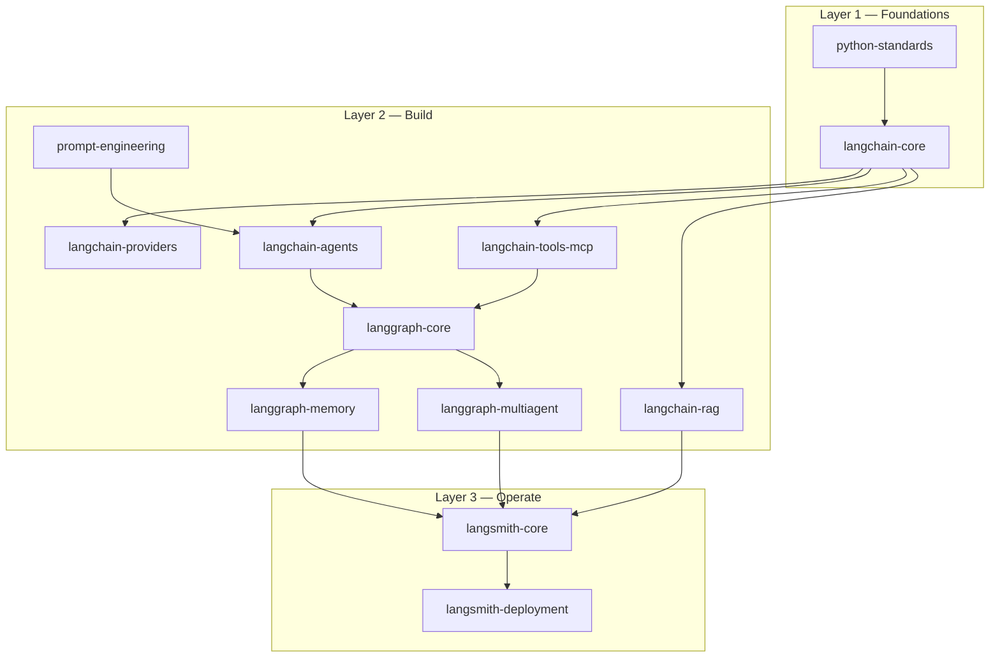

# AgentCraft

[](LICENSE)
[](https://www.python.org/downloads/)
[](https://langchain-ai.github.io/langgraph/)
[](https://python.langchain.com/)

Claude Code plugin for building production LangGraph agents with the full LangChain/LangGraph/LangSmith stack.

## Highlights

- **12 specialised skills** covering the complete agent development lifecycle — from Python project setup through multi-agent topology, RAG pipelines, MCP tool integration, tracing, and production deployment.
- **4 expert agents** — an architect for topology planning (Opus), a code generator that produces runnable implementations (Sonnet), a deployment specialist for LangSmith/self-hosted, and a debugger that diagnoses failures from LangSmith traces.
- **Three-layer skill model** — Foundation → Build → Operate. Each layer explicitly depends on the one below it, so you always know which skill governs which decision.
- **No deprecated patterns.** Skills enforce LangChain Core 1.x and LangGraph 1.x APIs: `create_agent`, `init_chat_model`, `PostgresSaver`, `InjectedStore`, `aindex()`. `AgentExecutor`, `LLMChain`, and `ConversationBufferMemory` are never suggested.
- **LangSmith-first observability.** Every skill assumes `LANGSMITH_TRACING=true`. Evaluation datasets and LLM-as-judge evaluators are defined from day one, not as an afterthought.

## Table of Contents

- [Installation](#installation)
- [Agent Architecture](#agent-architecture)
  - [Skill Layers](#skill-layers)
  - [Skill Composition](#skill-composition)
  - [Agents](#agents)
- [Usage](#usage)
  - [Auto-invocation](#auto-invocation)
  - [Explicit invocation](#explicit-invocation)
  - [End-to-end workflow](#end-to-end-workflow)
- [Configuration](#configuration)
- [Contributing](#contributing)
- [License](#license)

## Installation

Requires [Claude Code](https://docs.anthropic.com/en/docs/claude-code) v2.1.142 or later.

Clone the repository and install the plugin:

```bash
git clone https://github.com/josephsearle/agentcraft
cd agentcraft
claude plugin install .
```

To test without installing:

```bash
claude --plugin-dir .
```

Verify the plugin loaded:

```text
/plugin list
# agentcraft  1.0.0  enabled
```

## Agent Architecture

### Skill Layers

The 12 skills are organised into three layers. Each layer builds on the one below it — you cannot effectively use a Layer 2 skill without the concepts from Layer 1.



**Layer 1 — Foundations**

| Skill | Governs |
|-------|---------|
| `python-standards` | `uv`, Ruff, pyright, pytest, Google docstrings, `src/` layout, pre-commit. The baseline every other skill assumes. |
| `langchain-core` | LCEL pipe syntax, `init_chat_model`, `astream_events`, `with_structured_output`, `CacheBackedEmbeddings`, v1 content blocks. Every LangChain/LangGraph skill depends on this one. |

**Layer 2 — Build**

| Skill | Governs |
|-------|---------|
| `langchain-providers` | Provider-specific config on top of `langchain-core`: `ChatBedrockConverse` for AWS, Responses API for OpenAI, extended thinking for Anthropic, `with_retry`, `with_fallbacks`. |
| `langchain-agents` | The `create_agent` factory — compiles to a `CompiledStateGraph`. Default entry point for any standard tool-calling agent. Reach for `langgraph-core` directly only when you need full graph control. |
| `langchain-tools-mcp` | `@tool`, `BaseTool`, `InjectedToolCallId`, `MultiServerMCPClient`, server-side tools, `with_structured_output` strategy. Tool description quality is the primary determinant of agent quality. |
| `langchain-rag` | Idempotent ingestion (`SQLRecordManager` + `aindex()`), vector store selection, hybrid search, `SemanticChunker`, two-stage retrieve-then-rerank. |
| `langgraph-core` | `StateGraph`, reducers, `PostgresSaver`, `interrupt()`, `Command(resume=)`, streaming modes, `RetryPolicy`, `CachePolicy`, time-travel. The engine `langchain-agents` compiles to. |
| `langgraph-memory` | Short-term context management (`trim_messages`, `SummarizationNode`) and long-term cross-thread memory (`PostgresStore`, `InjectedStore`, LangMem SDK). |
| `langgraph-multiagent` | Supervisor pattern (`Command(goto=...)`), swarm (`create_handoff_tool`), `RemoteGraph`, `langgraph-bigtool`, Deep Agents harness (`create_deep_agent`, middleware). |
| `prompt-engineering` | System prompt design for every node archetype — planner, router, executor, critic, summariser, RAG retriever — matched to the right technique (Zero-Shot, CoT, ReAct, ToT, Reflexion). |

**Layer 3 — Operate**

| Skill | Governs |
|-------|---------|
| `langsmith-core` | `@traceable`, `LANGSMITH_TRACING`, `evaluate()`, `create_llm_as_judge`, `create_trajectory_match_evaluator`, prompt pull/push/promote by commit SHA. |
| `langsmith-deployment` | `langgraph.json`, `langgraph dev/build/deploy`, Agent Server runtime (Assistant, Thread, Run, Cron), self-hosted Docker Compose, BYOC Helm, `RemoteGraph` client. |

### Skill Composition

A typical project uses skills in this order:

```text
python-standards          ← pyproject.toml, uv, Ruff, pytest
  └─ langchain-core       ← init_chat_model, LCEL, streaming
       ├─ langchain-providers    ← tune the model provider
       ├─ langchain-tools-mcp   ← define tools + MCP client
       │    └─ langchain-agents ← create_agent → CompiledStateGraph
       │         └─ langgraph-core     ← customise graph topology
       │              ├─ langgraph-memory    ← short/long-term memory
       │              └─ langgraph-multiagent  ← supervisor / swarm
       ├─ langchain-rag         ← document retrieval
       ├─ prompt-engineering    ← node system prompts
       └─ langsmith-core        ← tracing + evaluation
            └─ langsmith-deployment   ← production deployment
```

### Agents

| Agent | Role | Model | When to use |
|-------|------|-------|-------------|
| `agentcraft:agent-architect` | Designs agent topology and produces an architecture plan | Opus (high effort) | Before writing any code — decide pattern, state schema, memory strategy |
| `agentcraft:code-generator` | Generates complete, production-ready Python implementation | Sonnet (high effort) | After the architecture is planned — produces runnable files |
| `agentcraft:deployment-specialist` | Writes `langgraph.json`, Docker Compose, CI/CD pipeline | Sonnet | When the code is ready and needs to go to production |
| `agentcraft:debugger` | Diagnoses and fixes runtime failures across the full stack | Sonnet (high effort) | When something is broken — always asks for a LangSmith trace URL first |

## Usage

### Auto-invocation

Skills load automatically when Claude detects relevant context. Mentioning `create_agent`, `StateGraph`, `PostgresSaver`, `@traceable`, `aindex()`, or any trigger phrase from a skill description causes that skill to activate. You do not need to invoke skills manually for most tasks.

### Explicit invocation

Invoke any skill or agent directly from the Claude Code prompt:

```text
/agentcraft:agent-architect   <your request>
/agentcraft:code-generator    <your request>
/agentcraft:deployment-specialist  <your request>
/agentcraft:debugger          <your request>
```

Individual skills can also be invoked by name — for example, `/agentcraft:langgraph-core` for a targeted question about checkpointing or streaming.

### End-to-end workflow

**Step 1 — Design the architecture**

```text
/agentcraft:agent-architect
I need a customer support agent that searches our knowledge base
and can escalate unresolved issues to a human for review.
```

The agent produces a structured plan: topology choice, state schema, memory strategy, RAG pipeline config, and implementation order.

**Step 2 — Generate the implementation**

```text
/agentcraft:code-generator
Implement the plan above. Use Anthropic Claude via ChatBedrockConverse,
PGVector for the knowledge base, and PostgresSaver for checkpointing.
```

The agent outputs complete, runnable Python files with a `pyproject.toml` dependency block and a `langgraph.json`.

**Step 3 — Deploy to production**

```text
/agentcraft:deployment-specialist
Set up a self-hosted deployment with Docker Compose.
```

The agent produces a working `docker-compose.yml` with the Agent Server, Postgres, and Redis containers configured correctly.

**Step 4 — Debug failures**

```text
/agentcraft:debugger
My search_knowledge_base tool is never being called.
Trace: https://smith.langchain.com/public/...
```

The agent reads the trace, identifies the root cause (missing `Field(description=...)`, schema mismatch, etc.), and outputs the exact file and line to change.

## Configuration

When you enable the plugin, Claude Code prompts for the following values. All are optional except where noted.

| Variable | Required | Description | Example |
|----------|----------|-------------|---------|
| `LANGSMITH_API_KEY` | Recommended | Enables tracing and evaluation in LangSmith. Get one at [smith.langchain.com](https://smith.langchain.com). | `lsv2_pt_...` |
| `LANGSMITH_PROJECT` | No | LangSmith project that traces are written to. | `my-agent` (default: `default`) |
| `OPENAI_API_KEY` | Conditional | Required only if using OpenAI or Azure OpenAI models directly. | `sk-...` |
| `ANTHROPIC_API_KEY` | Conditional | Required only if using Anthropic models directly (not via Bedrock). | `sk-ant-...` |

Sensitive values (`LANGSMITH_API_KEY`, `OPENAI_API_KEY`, `ANTHROPIC_API_KEY`) are stored in the OS keychain, not in `settings.json`.

For AWS Bedrock, configure credentials via the standard AWS credential chain (`~/.aws/credentials`, environment variables, or IAM role) — no plugin config entry is needed.

## Contributing

Contributions are welcome. The plugin is a collection of Markdown skill files — no build step required.

To add or improve a skill:

1. Fork the repository and create a branch from `main`.
2. Add or edit the skill under `skills/<skill-name>/SKILL.md`. Follow the frontmatter schema: `name`, `description` (with trigger phrases), and numbered steps.
3. If the skill loads reference files, add them to `skills/<skill-name>/references/`.
4. Validate the plugin structure before opening a pull request:

```bash
claude plugin validate .
claude plugin validate . --strict
```

5. Open a pull request with a clear description of what changed and why.

For significant changes — new skills, new agents, or changes to the layer model — please open an issue first to discuss the approach.

## License

[MIT](LICENSE) © 2024 Joseph Searle
>>>>>>> 5ced87d (feat: initialise agentcraft Claude plugin)
